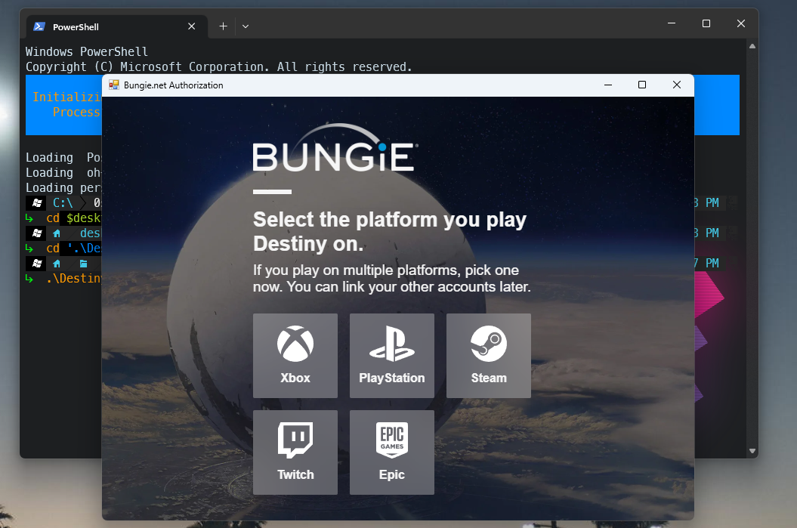

# Destiny API PowerShell Bootstrapper
This repo will help you quickly bootstrap initial authentication using the Bungie Destiny API. It uses WinForms with a modern webview2 control.

Assumptions:
- You have created a PRIVATE application at [https://www.bungie.net/en/Application](https://www.bungie.net/en/Application)
- Capture the API Key, Client ID, and Client Secret
- Set the redirect URI to "https://localhost.local" (The bootstrapper will handle capturing the auth code silently)

Feel free to use as a jumpstart for your own projects.